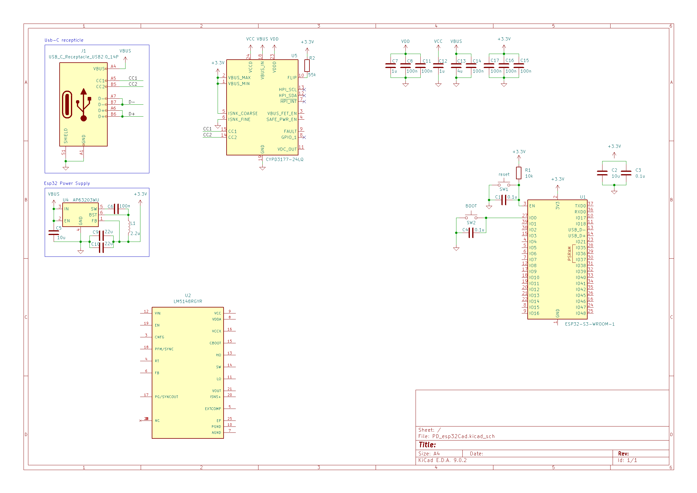

# esp32_PD

**ESP32 Power Delivery (PD) board for WLED** Not finished

## Rationale
Easy to use module that powers LED strips without losing out on features and aesthetics.  
Previously I had a 20 amp power supply that was bulky and not pretty or easy to hide.  
**Reason for being**: power SK6812 light strips on the back of an IKEA Skådis.  
Of course, can be used to power any 5V addressable light strip.

## Project Requirements
- ESP32 controller for WLED  
- USB-C for power and programming  
  - 100W Power Delivery
- 5v out @ as much amps reasonably possible
- Aesthetics

## Reasons for Choosing Some of the Things I Did
**USB-C Power Delivery:** Avoid bulky or single-purpose power supplies.  
You can unplug LEDs to charge a laptop or just not waste time, money, or resources on a limited-use power supply.  
Also, everyone knows how to plug in USB-C cables.

## Warning
For the sake of simplicity, the Power Delivery Sink is designed to request **maximum PD 3.0 (20V @ 5A)** for a total of ~100 watts of power.  
You do need a **100W USB-C brick or above**.  
(ESP32 will always receive power for programming, but lights will not get power without the full 100W source.)

This is a safety feature to aviod forgetting to change wled max load the pulling more than supplied. 
someone who knows what they are doing could change this with the sink's i2c pins and do backflips or whatever idc its not my house

100W is plenty enough.  
(I could not find a PD 3.1 250W sink readily in stock and blah blah blah—100W simplifies everything.)

---

**P.S.** This is my first time designing PCBs, so if something looks wrong, it's probably because it is—**and you should tell me... PLEASE** 🙃

